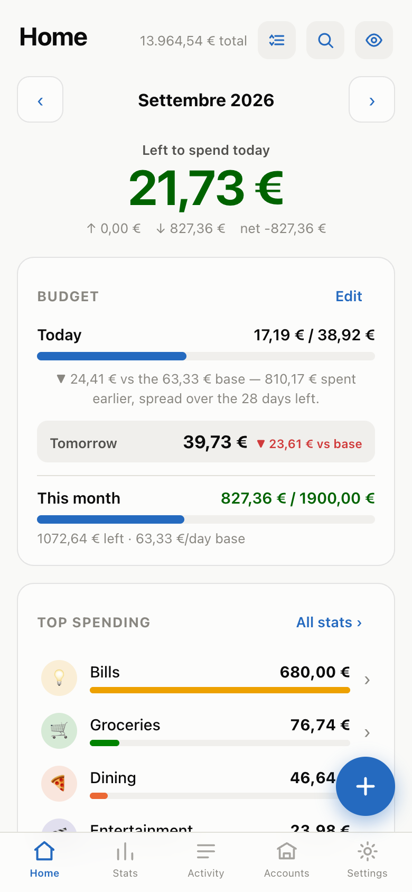
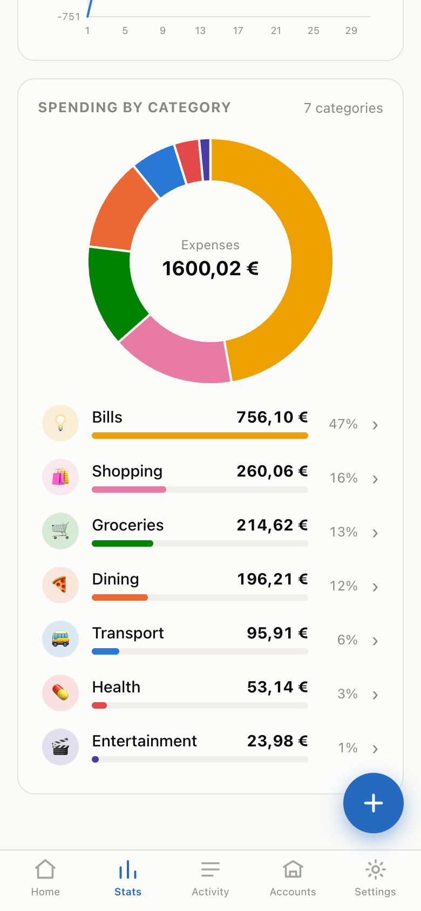
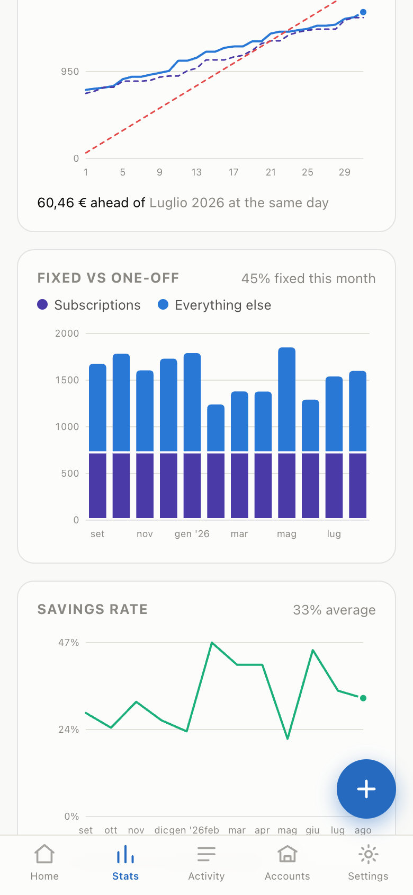
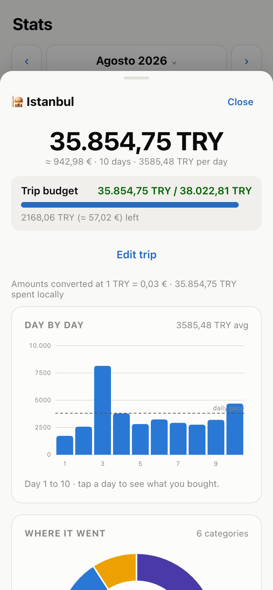
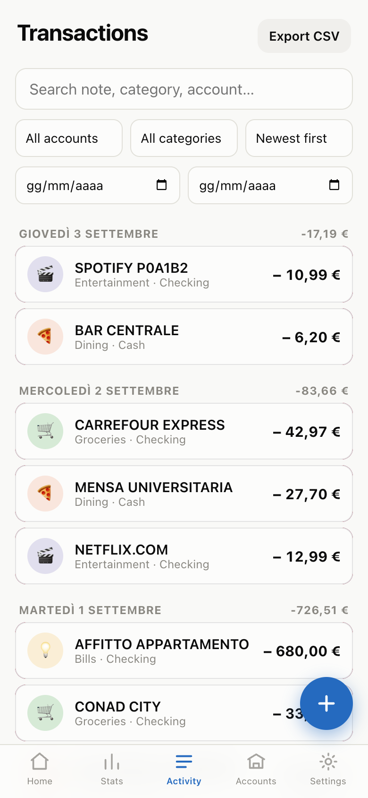
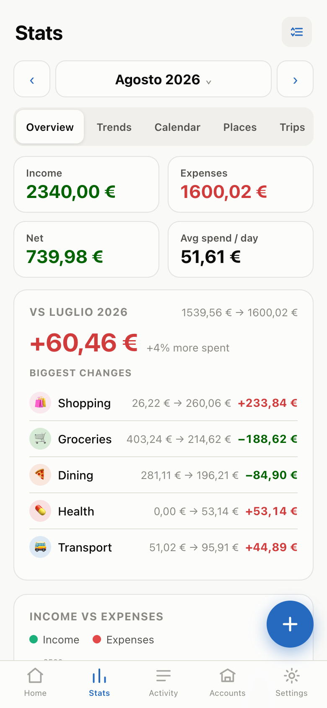

# Expense Tracker

**A private, offline expense tracker you install on your phone. No account, no server, no
network calls — your money data never leaves your device.**

[](LICENSE)
[](https://github.com/pippodima/expense-tracker-web/actions/workflows/tests.yml)


It's a Progressive Web App written in plain HTML, CSS and vanilla JavaScript — no framework,
no bundler, no `node_modules`. You serve the folder as static files and add it to your iPhone
Home Screen; from then on it launches full-screen and works in airplane mode.

<p align="center">
  
  
  
</p>
<p align="center">
  
  
  
</p>

<sub>Screenshots use generated demo data — see [`tools/`](tools/). Nobody's real spending is
in this repo.</sub>

---

## Why it exists

Most expense apps want an account, a subscription, and a copy of your bank history on someone
else's server. This one is built on the opposite bet: **everything is local, and your data is
yours as files.**

- **100% client-side.** No backend, no accounts, no authentication, no API keys, no analytics,
  no third-party scripts, fonts or CDNs. The app makes *zero* network requests.
- **Offline-first.** A service worker caches the whole app shell; once loaded it runs with no
  connection at all.
- **Your data stays put.** Everything lives in IndexedDB on your device (with an in-memory
  fallback). The only way data leaves is when *you* export a JSON or CSV file.
- **One-handed and mobile-first.** Big touch targets, bottom-sheet forms, swipe gestures,
  light/dark themes, Italian EUR formatting (`1.234,56 €`).

Browser storage *can* be evicted by iOS, so backups are a first-class feature rather than an
afterthought — the app actively nudges you to export.

---

## Features

**Daily use**
- Five tabs — Home · Stats · Activity · Accounts · Settings — plus a floating **+** to add a
  transaction from anywhere, and a `?action=add` deep link for a Home/Lock Screen shortcut.
- Add sheet with income/expense toggle, comma decimals, quick account & category chips, and a
  note field that **auto-suggests a category** from your keyword rules as you type.
- One-tap **repeat chips** for your most frequent recent charges.
- Swipe right to edit, swipe left to delete, on every row — with **undo** instead of confirm
  dialogs. Every bottom sheet can be dragged down to dismiss.
- **Global search** across notes, merchants (normalized, so "unicoop" finds every branch),
  categories, accounts and amounts.

**Money model**
- Multiple **accounts** (checking / savings / cash / credit) with computed balances, plus
  **transfers** between them — excluded from income, expenses, net and every stat, so moving
  money doesn't look like spending. Cash accounts can be **reconciled** against reality.
- **Budgets** in two modes: a flat monthly cap, or *spread per day* — whatever's left is
  redistributed evenly across the days remaining, so underspending today grows tomorrow.
  Per-category monthly limits on top.
- **Trips**: a date range with an optional budget of its own, kept out of monthly stats by
  default. Trips can carry a **foreign currency** and a hand-entered rate — you type prices
  in the local currency and the trip talks back to you in it, while EUR stays canonical
  underneath. Each trip gets its own day-by-day, category and pace charts.
- **Subscriptions** detected from repeating charges, and confirmed ones treated as fixed costs
  everywhere it matters.

**Stats**
- Five sub-views: **Overview · Trends · Calendar · Places · Trips**, over Month / Year / All /
  Custom timeframes with automatic bucketing.
- Overview: summary tiles, income-vs-expenses bars, net-over-time line, tappable
  spending-by-category donut.
- Trends (6 / 12 / 24-month windows): categories over time as stacked bars, **what changed**
  (each category against the mean of the 3 preceding months, with sparklines), **pace this
  month** vs last, fixed vs one-off, savings rate, weekday rhythm.
- Every stacked card on Home and Stats is a **block** you can reorder or hide from the ⇅
  Arrange sheet; the layout is saved and travels inside your backups.
- Charts are hand-built SVG with a colorblind-safe palette, light/dark aware. No chart library.

**Getting data in**
- **Universal CSV/JSON importer** (`js/detect.js`): matches headers in several languages *and*
  sniffs content, so it works with unknown, unhelpful or missing headers. Handles preamble junk
  above the header row, `,` `;` tab `|` delimiters, EU vs US decimals, debit/credit pairs,
  single signed amounts, a separate direction column ("Uscita/Entrata", "D/C", …), ISO
  datetimes, textual months, 2-digit years, parenthesised negatives and currency symbols.
  Ambiguous DD/MM vs MM/DD is flagged, not guessed.
- **Never duplicates.** Re-importing is safe: bank rows upsert by `externalId` and are adopted
  by matching manual entries; CSV skips date+amount+description duplicates; JSON backups offer
  **Merge** (matching categories and accounts by name) or Replace.
- Likely **cash withdrawals** are offered as transfers to a cash account instead of expenses.
- **Statement paste import** — see [`sync/README.md`](sync/README.md): a stdlib-only Python
  script that turns a copy-pasted bank statement into an importable file. It runs *on the
  iPhone* in a-Shell, so nothing about the workflow needs a computer.

**Privacy & durability**
- **Private mode**: blur balances (level 1) or every amount (level 2), with tap-to-peek and an
  optional re-hide when you close the app. The "left to spend today" figure is never masked —
  it reveals nothing about your wealth.
- **Backups**: full JSON export/import, filtered CSV export, automatic device snapshots, and a
  reminder that fires after *N* days **or** *N* changes, whichever comes first.

---

## Quick start

```bash
git clone https://github.com/pippodima/expense-tracker-web.git
cd expense-tracker-web
python3 -m http.server 8123
```

Open <http://localhost:8123> — or `http://<your-computer-ip>:8123` from a phone on the same
Wi-Fi.

> It must be served over **http(s)**. Opening `index.html` as a `file://` URL won't register
> the service worker, so offline mode and installation won't work.

### Install on your phone

The Home Screen install needs **HTTPS**, so host the folder on any static host — GitHub Pages
works and is free:

1. Push the repo, then **Settings → Pages → Deploy from a branch → `main` / root**.
2. Open the resulting URL in **Safari** on your iPhone and let it load once.
3. **Share → Add to Home Screen.**

It now launches full-screen and works offline. There is nothing to build or configure.

> The service worker cache is versioned (`expense-tracker-vNN` in [`sw.js`](sw.js)) and bumped
> on every release, so installed copies pick up changes the next time they're online.

---

## Project structure

| Path | What it does |
|------|--------------|
| [`index.html`](index.html) | App shell: five tab views, floating add button, iOS install meta |
| [`css/style.css`](css/style.css) | All styling — design tokens, light/dark, components, gestures, safe areas |
| [`js/util.js`](js/util.js) | Formatting (EUR it-IT, dates, rates), ids, the chart palette, DOM helpers, toasts, downloads |
| [`js/db.js`](js/db.js) | Storage — IndexedDB with a transparent in-memory fallback, plus domain helpers (balances, category suggestion, duplicate keys) |
| [`js/csv.js`](js/csv.js) | CSV parsing and serialization, bank date/amount parsing |
| [`js/detect.js`](js/detect.js) | The universal importer: format, delimiter, column and direction detection |
| [`js/charts.js`](js/charts.js) | Hand-built SVG charts — donut, bars, stacked bars, multi-line, sparkline |
| [`js/app.js`](js/app.js) | Views, navigation, sheets, budgets, trips, stats, import wizard, backups |
| [`sw.js`](sw.js) | Service worker — network-first for our own files, cache fallback for offline |
| [`manifest.webmanifest`](manifest.webmanifest) | PWA manifest (standalone, icons, `?action=add` shortcut) |
| [`sync/`](sync/) | Optional statement converter that runs on the phone — not part of the app runtime |
| [`tests/`](tests/) | Zero-dependency Node test suite |
| [`tools/`](tools/) | Demo-data generator and the screenshot capture script — dev only |
| [`PROJECT_DIARY.md`](PROJECT_DIARY.md) | The full story: every chapter, decision and bug, in order |

There is no framework and no global state library. `DB.state` is the source of truth, mirrored
to IndexedDB; a small `ui` object in `app.js` holds view and filter state. Data records —
transactions, accounts, categories, rules, presets and a `meta` key/value store — all carry a
stable `id`.

---

## Tests

```bash
node tests/run.js
```

No dependencies, no framework, no runner to install — matching the app itself. Three layers,
because each catches what the previous one can't:

1. `node --check` on every source file — syntax.
2. **scope-check** — identifiers that resolve to nothing at runtime. A `const` referenced from
   the wrong function is a `ReferenceError` that `node --check` accepts happily; that exact
   mistake once shipped a half-rendered add-transaction sheet.
3. **`*.test.js`** — the real functions, extracted from `js/app.js` and run against a fake DOM
   with pinned dates, covering budget maths, trip charts and the block layout engine.

CI runs the same command on every push.

### Regenerating the screenshots

The images above are captured from the real app against generated demo data, so they can be
refreshed rather than re-shot by hand. Puppeteer is deliberately **not** a project dependency —
install it anywhere outside the repo and point Node at it:

```bash
mkdir -p /tmp/shots && (cd /tmp/shots && npm init -y && npm i puppeteer)
node tools/demo-data.js                                    # → tools/demo-backup.json
NODE_PATH=/tmp/shots/node_modules node tools/screenshots.js  # → docs/screenshots/*.png
```

[`tools/demo-data.js`](tools/demo-data.js) is seeded, so the same commit always produces the
same charts. It invents ~470 transactions across 14 months, a monthly budget, four confirmed
subscriptions and a lira-priced trip to Istanbul — enough that every card has something real to
draw instead of hiding itself.

---

## Known limitations (and why)

- **No live iOS widget.** A Home/Lock Screen widget showing the daily total needs a native
  WidgetKit app. A PWA can't publish one — the `?action=add` deep link is the answer instead.
- **No background or push notifications.** Firing one while the app is closed requires a server
  and a push subscription. Offline and serverless by design, so backup reminders appear when
  you *open* the app.
- **Browser storage can be evicted.** iOS may clear website storage under pressure, on "clear
  Safari data", or if you delete the installed app. Mitigations: persistent-storage request,
  Home Screen install (own container), and insistent JSON backups.
- **Exchange rates are typed by hand.** The app makes no network calls, so it can't fetch them.
- **EUR is the canonical currency.** Foreign currencies exist only inside trips.

---

## Contributing

It's a personal project, but issues and pull requests are welcome. Two things to keep in mind:

1. **The constraints are the product.** No network calls from the app, no dependencies, no
   build step, no backend. If a change needs any of those, it belongs somewhere else.
2. Run `node tests/run.js` before opening a PR, bump the cache version in `sw.js` if you touch
   a cached file, and add a chapter to [`PROJECT_DIARY.md`](PROJECT_DIARY.md) — the diary is
   how this project remembers *why*.

---

## License

[MIT](LICENSE) © pippodima
